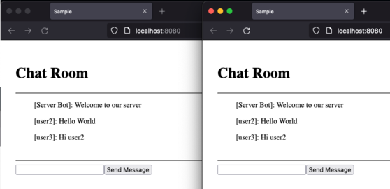

# Kotlin Multiplatform Fullstack Chat

- Kotlin/JVM Ktor Server
- Kotlin/JS Compose Web Frontend
- Shared DTOs
- WebSocket communication with ProtoBuf
- Generic server-client communication via polymorphic serialization

## Requirement
- JDK 17

## Run

- Start `./gradlew :run`
- Open http://localhost:8080
